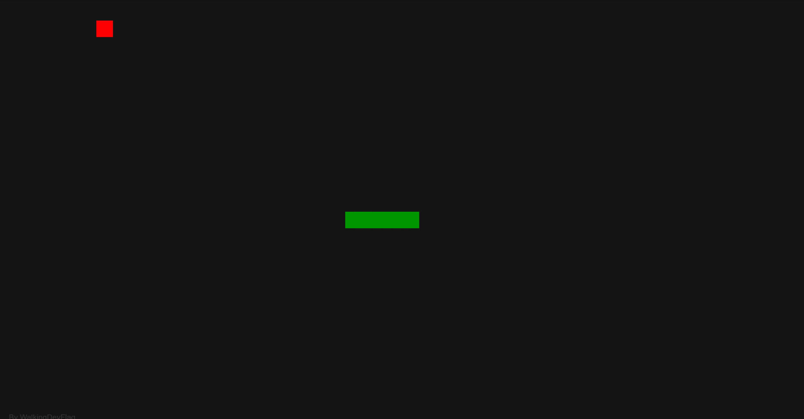

# Snake AI

[](https://developer.mozilla.org/en-US/docs/Web/JavaScript)
[](https://p5js.org/)
[](https://developer.mozilla.org/en-US/docs/Web/Guide/HTML/HTML5)
[](https://developer.mozilla.org/en-US/docs/Web/CSS)

This project is an implementation of an advanced Snake AI, inspired by CodeBullet's video "[I Created a PERFECT SNAKE A.I.](https://www.youtube.com/watch?v=tjQIO1rqTBE)". The AI navigates the snake using a pre-calculated Hamiltonian cycle and employs the A* search algorithm to find optimal shortcuts to the apple, while ensuring the snake doesn't trap itself.

## Demo




## Features

*   **Intelligent AI Opponent:** The snake is fully controlled by an AI.
*   **Hamiltonian Cycle Navigation:** Guarantees the snake can cover the entire board without collision if it strictly follows the cycle.
*   **A* Pathfinding for Shortcuts:** The AI dynamically calculates the shortest path to the apple, allowing it to "cut across" the Hamiltonian cycle for efficiency.
*   **Cycle Integrity:** The A* algorithm is constrained to prevent the snake from taking shortcuts that would lead to self-collision or an inescapable situation relative to its tail on the cycle.
*   **Visual Hamiltonian Overlay:** Press and hold the `Tab` key to visualize the underlying Hamiltonian cycle, node numbers, and grid.
*   **Adjustable AI Speed:**
    *   `Up Arrow`: Increases AI speed (by increasing frame rate).
    *   `Down Arrow`: Decreases AI speed (by decreasing frame rate).
    *   `Space Bar` (hold): Drastically increases AI speed (by increasing updates per frame).
*   **Dynamic Grid:** The game grid size (`blocksX`, `blocksY`) and rendering (`blockSize`) adapt based on window dimensions and a `maxBlocks` constraint.
*   **Automatic Restart:** The game restarts if the snake fills the entire board (win condition) or if the snake collides.

## How it Works

The AI's strategy is twofold:

1.  **Hamiltonian Cycle:**
    *   Upon starting, a Hamiltonian cycle is generated for the game grid. This is a path that visits every single cell (node) on the grid exactly once before returning to the start.
    *   The snake's body is initialized along a segment of this cycle.
    *   In the absence of a more direct path to the apple, or if a shortcut is too risky, the snake can default to following this cycle, ensuring it stays alive and covers ground.

2.  **A* Search for Shortcuts:**
    *   When an apple appears, the AI uses the A* search algorithm to find the shortest path from the snake's head to the apple.
    *   The "nodes" in this search are the cells of the game grid, and the "edges" are the possible moves (up, down, left, right) that are also part of the Hamiltonian cycle's connections.
    *   A crucial constraint in the A* search is the `overTakesTail` check. This function ensures that any proposed shortcut path doesn't lead the snake's head to a position on the cycle that is "behind" its tail (considering the snake's length and the cyclical nature of the path). This prevents the snake from cutting off its own path of retreat along the cycle.
    *   The path found by A* allows the snake to deviate from strictly following the cycle sequence, taking a more direct route to the apple. After consuming the apple, it recalculates its path.


## Setup and Installation

1.  **Clone the repository or download the files:**
    ```bash
    git clone https://github.com/WalkingDevFlag/Snake-AI.git
    cd Snake-AI
    ```
2.  **Run a Local Web Server:** Because browsers have security restrictions about opening local files that load other files, you need to serve the `index.html` file through a simple local web server.
    *   If you have Python 3 installed, open your terminal or command prompt, navigate to the project's main directory (the one containing `index.html`), and run:
        ```bash
        python -m http.server
        ```
    *   If you have Node.js installed, you can use `npx`:
        ```bash
        npx http-server
        ```
    *   Alternatively, use any simple web server tool you prefer.
3.  **Open in Browser:** Once the server is running, open your web browser and go to the address provided by the server (usually `http://localhost:8000` or `http://127.0.0.1:8000`). You should see the Snake AI running.

## Controls

*   **`Tab` Key:** Press and **hold** to display the Hamiltonian cycle overlay (shows grid lines, cycle path, and node numbers). Release to hide.
*   **`Up Arrow` Key:** Increases the AI's speed (by increasing the game's frame rate).
*   **`Down Arrow` Key:** Decreases the AI's speed (by decreasing the game's frame rate).
*   **`Space Bar`:** Press and **hold** to significantly speed up the AI (by increasing the number of snake updates per frame). Release to return to the speed set by arrow keys/default.


## Acknowledgements

*   This project is heavily inspired by the brilliant work of **CodeBullet** and his YouTube video: "[I Created a PERFECT SNAKE A.I.](https://www.youtube.com/watch?v=tjQIO1rqTBE)".
*   The core AI strategy (Hamiltonian cycle + A* shortcuts) is based on his final approach demonstrated in the video.

## License

This project is licensed under the MIT License. See the [LICENSE](LICENSE.md) file for details
[](https://opensource.org/licenses/MIT)
